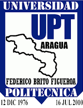

<h1 align="center">Proyecto de Acreditables</h1>

<p align="center">
    
</p>

## 🖥Código
Clone el repositorio en la ubicación que desee.
```
git clone https://github.com/JesusMiguel03/ProyectoAcreditables.git
```
Requiere tener instalado [composer](https://getcomposer.org/download/)
```
composer install
```
En el editor de su preferencia, abra la carpeta clonada y use los siguientes comandos:
```
cp .env.example .env
```
```
php artisan key:generate
```
```
php artisan migrate --seed
```
Para que las imágenes sean accesibles una vez guardadas:
```
php artisan storage:link
```
```
php artisan serve
```
<strong>Para recibir las actualizaciones:</strong>
Dentro de la carpeta donde se encuentra el proyecto
```
git pull
```
```
composer update
```
```
php artisan migrate:fresh --seed
```

## Sobre el proyecto

Componente web diseñado para la gestión administrativa de procesos dentro de la Coordinación de Acreditables. Dispone de las siguientes funciones:

- Inscripción de estudiantes y profesores.
- Gestión de cursos/materias.
- Personalización de perfil, cambio de contraseña y nombre.
- Gráficos, estadísticas y reportes.
- Listados de estudiantes y comprobantes de inscripción en formato PDF.

**Lenguajes**
- HTML5.
- CSS3.
- JavaScript.
- Php.

**Plugins**
- [jQuery](https://jquery.com/download/).
- [SweetAlert2](https://sweetalert2.github.io).
- [DataTables](https://datatables.net).
- [Slick](http://kenwheeler.github.io/slick/).
- [Spatie](https://spatie.be/docs/laravel-permission/v5/introduction).

**Frameworks**
- [Bootstrap (Frontend)](https://getbootstrap.com/docs/4.6/getting-started/introduction/).
- [Laravel (Backend)](https://laravel.com/docs/8.x/installation).
